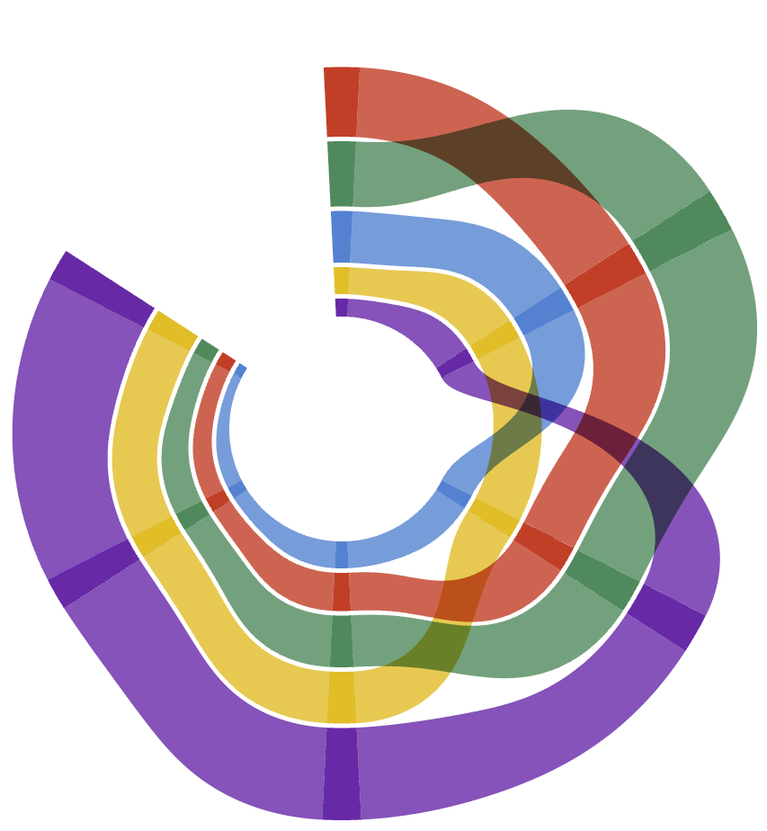
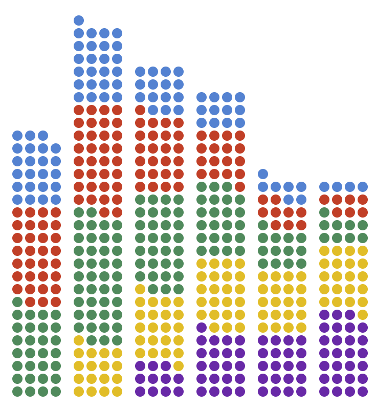

<StackV gap="2rem">
  <StackV gap="2rem">
    <h1 style="font-family: 'Balsamiq Sans', sans serif; color: coral; font-size: 72pt; margin: 2rem;"><b>Starfish Graphics</b></h1>
    <h2 style="font-family: 'Source Sans 3', sans serif; font-size: 36pt; color: #301812;">Make stylish visualizations in JavaScript with ease</h2>
  </StackV>

<StackH width="fit-content" gap="1rem" style="margin: 0 auto; margin-top: -1rem; margin-bottom: -4rem">

  npm install starfish-graphics

<VPButton
    tag="a"
    size="medium"
    text="Get Started!"
    theme="brand"
    href="/get-started"
  />
<VPButton
    tag="a"
    size="medium"
    text="Tutorial"
    theme="alt"
    href="/tutorial"
  />
<VPButton
    tag="a"
    size="medium"
    text="Examples"
    theme="alt"
    href="/examples"
  />
<!-- <VPButton
    tag="a"
    size="medium"
    text="API Reference"
    theme="alt"
    href="/api"
  /> -->

</StackH>

  

  

    
    <!-- <a href="/examples/ribbon-charts.html#polar-ribbon-chart"> -->
      
    <!-- </a> -->
    <!--  -->
    
    
    
    
  

  

    <StackV gap="2rem" align="flex-start" style="margin: 0 auto;">
      <h2 style="font-family: 'Balsamiq Sans', sans serif; font-size: 36pt; color: coral;">Why Starfish?</h2>
      <StackV gap="1.5rem" width="100%" align="flex-start">
        <StackV gap="0.6rem" width="100%" align="flex-start">
          <h3 style="font-family: 'Source Sans 3', sans serif; font-size: 24pt; color: #301812;">You're a star! Express yourself!</h3>
          
Minimalist? Maximalist? Formal? Whimsical? Whatever your style, Starfish is here for you.

        </StackV>
        <StackV gap="0.6rem" width="100%" align="flex-start">
          <h3 style="font-family: 'Source Sans 3', sans serif; font-size: 24pt; color: #301812;">Beauty by default</h3>
          
Starfish's design system of colors, spacing, and arrows build on graphic design best practices helping you get beautiful results out of the box.

        </StackV>
        <StackV gap="0.6rem" width="100%" align="flex-start">
          <h3 style="font-family: 'Source Sans 3', sans serif; font-size: 24pt; color: #301812;">Power when you need it</h3>
          
Starfish makes easy things simple, like bar charts and scatter plots. But Starfish lets you make complex custom charts and diagrams, too.

        </StackV>
      </StackV>
    </StackV>
  

  

  </StackV>

