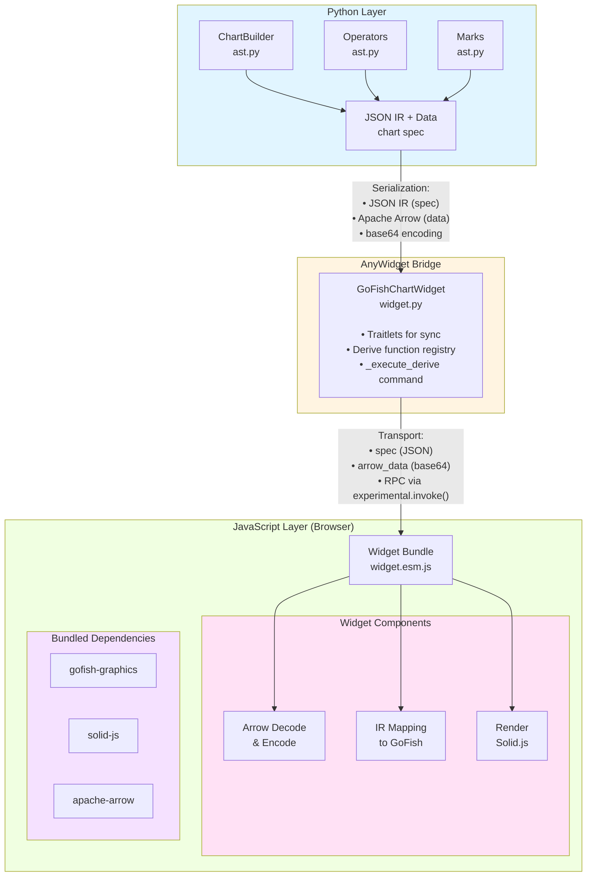

# GoFish Python Implementation Architecture

## Overview

The gofish-python package provides a Python interface to the GoFish Graphics library, enabling users to create interactive visualizations in Jupyter notebooks using a Pythonic API. The implementation consists of three main layers:

1. **Python API Layer** - Fluent chart-building API that mirrors the JavaScript v3 API
2. **Intermediate Representation (IR)** - JSON-based specification that bridges Python and JavaScript
3. **Widget Rendering Layer** - AnyWidget-based browser rendering with bidirectional RPC

## High-Level Architecture



## Component Details

### 1. Python API Layer (`gofish/ast.py`)

The Python layer provides a fluent, builder-pattern API for constructing chart specifications.

#### Key Classes

**ChartBuilder**

- Immutable builder pattern (each method returns a new instance)
- Holds data, operators, mark, and options
- Methods:
  - `flow(*operators)` - Add operators to the pipeline
  - `mark(mark)` - Set the visual encoding
  - `to_ir()` - Serialize to JSON IR
  - `render(w, h, axes, debug)` - Create and display widget

**Operator**

- Base class for all operators (spread, stack, group, scatter)
- Stores operator type and parameters
- `to_dict()` method serializes to IR format

**DeriveOperator** (special case)

- Extends Operator
- Stores a Python callable (lambda or function)
- Generates unique `lambda_id` (UUID) for RPC identification
- The actual function is NOT serialized (stays Python-side)

**Mark**

- Base class for all marks (rect, circle, line, area, scaffold)
- Stores mark type and visual encoding parameters
- `to_dict()` method serializes to IR format

#### Factory Functions

The module exports factory functions for ergonomic API:

- Operators: `spread()`, `stack()`, `derive()`, `group()`, `scatter()`
- Marks: `rect()`, `circle()`, `line()`, `area()`, `scaffold()`
- Chart: `chart(data, options)`

### 2. Data Marshaling (`gofish/arrow_utils.py`)

Efficient data transfer between Python and JavaScript using Apache Arrow IPC format.

**Why Apache Arrow?**

- Zero-copy deserialization in JavaScript
- Type preservation (int vs float vs string)
- 3-5x smaller than JSON for tabular data
- Efficient for large datasets (100k+ rows)

**Key Functions**

`dataframe_to_arrow(df: pd.DataFrame) -> bytes`

- Converts pandas DataFrame to Arrow IPC bytes
- Handles Int64 � Int32 conversion (JavaScript compatibility)
- Uses streaming format for efficient serialization

`arrow_to_dataframe(arrow_bytes: bytes) -> pd.DataFrame`

- Converts Arrow IPC bytes back to pandas DataFrame
- Used for deserializing data from JavaScript (for derive RPC)

**Type Handling**

- Int64/UInt64 columns are automatically downcasted to Int32/UInt32 if values fit
- Prevents JavaScript BigInt issues while preserving precision when possible
- Falls back to original type if values are too large

### 3. Intermediate Representation (IR)

The IR is a simple, flat JSON structure that describes the chart specification.

**Format**

```json
{
  "data": null,
  "operators": [
    {
      "type": "spread",
      "field": "lake",
      "dir": "x",
      "spacing": 64
    },
    {
      "type": "derive",
      "lambdaId": "a8f3b2c1-..."
    },
    {
      "type": "stack",
      "field": "species",
      "dir": "y"
    }
  ],
  "mark": {
    "type": "rect",
    "h": "count",
    "fill": "species"
  },
  "options": {
    "w": 800,
    "h": 600
  }
}
```

**Design Choices**

1. **Data is separate** - Data is marshaled via Arrow, not included in IR
2. **Flat operator list** - Current implementation assumes linear pipeline (chart API)
3. **String-based types** - Simple and JSON-serializable
4. **Lambda IDs for derive** - Functions can't be serialized, so we use IDs for RPC

**Limitations**

- Cannot represent nested operator trees (for low-level v1/v2 APIs)
- No support for custom operators (no registry pattern yet)
- No schema validation (relies on JavaScript to fail gracefully)

### 4. Widget Layer (`gofish/widget.py`)

AnyWidget-based Jupyter widget for rendering charts in the browser.

**GoFishChartWidget**

Inherits from `anywidget.AnyWidget` to provide seamless Jupyter integration.

**Traitlets (State Management)**

- `spec` (Dict, synced) - Chart specification JSON
- `arrow_data` (Unicode, synced) - Base64-encoded Arrow IPC bytes
- `derive_functions` (Dict, NOT synced) - Python-only registry mapping lambda_id � callable
- `width`, `height`, `axes`, `debug` (synced) - Render options
- `container_id` (synced) - Unique DOM element ID

**Widget Initialization Flow**

1. Load pre-built widget bundle from `gofish/_static/widget.esm.js`
2. Fail fast with clear error if bundle is missing
3. Convert Arrow bytes to base64 for transport
4. Store derive functions in Python-side registry
5. Initialize AnyWidget with `_esm` code and synced traitlets

**RPC Mechanism for Derive**

The `_execute_derive` command enables JavaScript to call Python during rendering:

```python
@anywidget.experimental.command
def _execute_derive(self, msg: dict, buffers: list):
    lambda_id = msg["lambdaId"]
    arrow_b64 = msg["arrowB64"]

    # Look up Python function
    fn = self.derive_functions[lambda_id]

    # Deserialize Arrow � DataFrame
    df = arrow_to_dataframe(base64.b64decode(arrow_b64))

    # Execute user function
    result_df = fn(df)

    # Serialize result � Arrow � base64
    result_b64 = base64.b64encode(dataframe_to_arrow(result_df))

    return {"resultB64": result_b64}, buffers
```

**Why AnyWidget?**

- Native Jupyter support (JupyterLab, Notebook, VSCode, Colab)
- ESM module support (modern JavaScript)
- Bidirectional communication via traitlets + commands
- No backend server required (client-side rendering)
- Active development and good documentation

### 5. JavaScript Widget Bundle (`widget-src/index.ts`)

Self-contained ESM bundle that runs in the browser.

**Architecture**

The widget is a single TypeScript module bundled with all dependencies:

```typescript
import * as Arrow from "apache-arrow";
import { chart, spread, stack, ... } from "gofish-graphics";

export default {
  async render({ model, el, experimental }) {
    // 1. Deserialize Arrow data
    // 2. Map IR operators to GoFish operators
    // 3. Map IR mark to GoFish mark
    // 4. Render chart
  }
}
```

**Key Functions**

`arrowTableToArray(table: Arrow.Table)`

- Converts Arrow Table to array of plain objects
- Handles BigInt � Number conversion
- Compatible with GoFish's data format expectations

`arrayToArrow(rows: object[])`

- Converts array of objects to Arrow IPC bytes
- Used for serialize data for derive RPC
- Tries multiple methods for Arrow API compatibility

`mapOperator(opSpec, model, experimental)`

- Maps IR operator spec to GoFish operator function
- Uses lookup table `OPERATOR_MAP` for extensibility
- Special handling for `derive` (creates async RPC operator)

`mapMark(markSpec)`

- Maps IR mark spec to GoFish mark function
- Simple lookup table `MARK_MAP`

`renderChart(model, container, experimental)`

- Main rendering orchestrator
- Deserializes data and spec
- Reconstructs operator pipeline
- Calls GoFish's `chart().flow().mark()` API
- Renders to DOM container

**Derive RPC Implementation**

The derive operator in JavaScript is async and calls back to Python:

```typescript
derive: (opts, model, experimental) => {
  const lambdaId = opts.lambdaId;

  return derive(async (d) => {
    // Serialize current data to Arrow
    const arrowBuffer = arrayToArrow(normalizeToArray(d));
    const arrowB64 = btoa(String.fromCharCode(...arrowBuffer));

    // Call Python via RPC
    const [response] = await experimental.invoke("_execute_derive", {
      lambdaId,
      arrowB64,
    });

    // Deserialize result from Arrow
    const resultBuffer = Uint8Array.from(atob(response.resultB64), (c) =>
      c.charCodeAt(0)
    );
    const resultTable = Arrow.tableFromIPC(resultBuffer);
    const resultArray = arrowTableToArray(resultTable);

    return Array.isArray(d) ? resultArray : resultArray[0];
  });
};
```

**Error Handling**

- Try/catch around all major operations
- `renderError()` helper displays errors in the DOM
- Debug mode shows full stack traces
- Clear error messages for common issues

## Build System

### Widget Bundle Build (`build-widget.mjs`)

The widget bundle is built using esbuild at package build time.

**Build Configuration**

```javascript
{
  entryPoints: ["widget-src/index.ts"],
  bundle: true,              // Bundle all dependencies
  platform: "browser",       // Target browser environment
  target: "es2019",          // Modern JS (async/await, etc.)
  format: "esm",             // ES modules
  sourcemap: "inline",       // Include source maps for debugging
  outfile: "gofish/_static/widget.esm.js",
  external: [],              // Bundle everything (no externals)
}
```

**Dependency Resolution**

The build script uses a custom plugin to resolve `gofish-graphics`:

1. First checks for `../gofish-graphics/dist/index.js` (built package)
2. Falls back to `node_modules/gofish-graphics` (workspace link)
3. Fails with clear error if neither exists

**Why Bundle Everything?**

- No network access required at runtime
- No CDN dependencies (works offline, behind firewalls)
- Consistent versions (no import map conflicts)
- Faster startup (single file, no module resolution)
- ~2.2 MB total (acceptable for visualization library)

**Build Trigger**

The bundle is built via:

```bash
pnpm run build:widget
# or directly:
node build-widget.mjs
```

This should be run:

- During development (after widget code changes)
- Before package distribution (in CI/CD)
- Optionally in setup.py/pyproject.toml build hooks

### Python Package Structure

```
packages/gofish-python/
├── gofish/
│   ├── __init__.py           # Public API exports
│   ├── ast.py                # ChartBuilder, operators, marks
│   ├── widget.py             # AnyWidget implementation
│   ├── arrow_utils.py        # Arrow serialization
│   └── _static/
│       └── widget.esm.js     # Pre-built widget bundle (2.2 MB)
├── widget-src/
│   └── index.ts              # Widget TypeScript source
├── tests/
│   ├── test_ast.py           # Python unit tests
│   └── test_ir.ipynb         # Jupyter notebook tests
├── notes/
│   ├── implementation.md     # This file
│   └── motivation.md         # Project motivation
├── pyproject.toml            # Python package config
├── package.json              # Node.js dependencies for building
└── build-widget.mjs          # Widget build script
```

**Package Data**

The `pyproject.toml` specifies that `gofish/_static/widget.esm.js` should be included in the wheel:

```toml
[tool.setuptools.package-data]
gofish = ["_static/widget.esm.js"]
```

This ensures the bundle is available when users `pip install gofish-python`.

## Data Flow: End-to-End Example

Let's trace a complete example with a derive operator:

### Python Code

```python
import pandas as pd
from gofish import chart, spread, stack, derive, rect

data = pd.DataFrame({
    "lake": ["A", "A", "B", "B"],
    "species": ["X", "Y", "X", "Y"],
    "count": [10, 20, 15, 25]
})

chart(data) \
    .flow(
        spread("lake", dir="x", spacing=64),
        derive(lambda df: df.sort_values("count")),
        stack("species", dir="y")
    ) \
    .mark(rect(h="count", fill="species")) \
    .render(w=800, h=600)
```

### Step-by-Step Flow

**1. Chart Construction (Python)**

- `chart(data)` creates `ChartBuilder` with data reference
- `.flow(...)` adds three operators to the pipeline
- `derive(lambda ...)` creates `DeriveOperator` with unique `lambda_id="abc123"`
- `.mark(rect(...))` sets the mark
- `.render()` triggers serialization and widget creation

**2. Serialization (Python)**

- DataFrame � Arrow IPC bytes via `dataframe_to_arrow()`
- Arrow bytes � base64 string for JSON transport
- Chart spec � JSON IR via `to_ir()`
- Derive functions collected: `{"abc123": lambda df: df.sort_values("count")}`

**3. Widget Creation (Python)**

- `GoFishChartWidget` initialized with:
  - `spec` = JSON IR
  - `arrow_data` = base64 Arrow bytes
  - `derive_functions` = {"abc123": <function>}
  - `width=800, height=600`
- Widget loads `_esm` bundle from `_static/widget.esm.js`
- Widget syncs traitlets to JavaScript

**4. Widget Render (JavaScript)**

- AnyWidget calls `render({ model, el, experimental })`
- Decode base64 � Arrow bytes � `Arrow.tableFromIPC()`
- Convert Arrow Table � array of objects:
  ```js
  [
    {lake: "A", species: "X", count: 10},
    {lake: "A", species: "Y", count: 20},
    ...
  ]
  ```

**5. Operator Reconstruction (JavaScript)**

- Map `spread` operator:
  ```js
  spread("lake", { dir: "x", spacing: 64 });
  ```
- Map `derive` operator:
  ```js
  derive(async (d) => {
    // d is current data (array of objects)
    // Serialize to Arrow, call Python, deserialize result
    return await executeDeriveViaRPC("abc123", d);
  });
  ```
- Map `stack` operator:
  ```js
  stack("species", { dir: "y" });
  ```
- Map `rect` mark:
  ```js
  rect({ h: "count", fill: "species" });
  ```

**6. Chart Rendering (JavaScript)**

- Create GoFish chart:
  ```js
  chart(data).flow(spreadOp, deriveOp, stackOp).mark(rectMark);
  ```
- GoFish processes operators sequentially
- When it hits `deriveOp`, the async function executes

**7. Derive RPC (JavaScript � Python � JavaScript)**

JavaScript side:

```js
// Current data at this point in pipeline
const currentData = [...];  // After spread

// Serialize to Arrow
const arrowBuffer = arrayToArrow(currentData);
const arrowB64 = btoa(String.fromCharCode(...arrowBuffer));

// Call Python
const [response] = await experimental.invoke(
  "_execute_derive",
  { lambdaId: "abc123", arrowB64 }
);

// Deserialize result
const resultBuffer = Uint8Array.from(atob(response.resultB64), ...);
const resultTable = Arrow.tableFromIPC(resultBuffer);
const sortedData = arrowTableToArray(resultTable);
```

Python side (`_execute_derive`):

```python
# Receive Arrow bytes
arrow_bytes = base64.b64decode(arrow_b64)
df = arrow_to_dataframe(arrow_bytes)

# Execute user function
fn = self.derive_functions["abc123"]  # lambda df: df.sort_values("count")
result_df = fn(df)

# Return Arrow bytes
result_arrow = dataframe_to_arrow(result_df)
result_b64 = base64.b64encode(result_arrow)
return {"resultB64": result_b64}
```

**8. Final Render (JavaScript)**

- Sorted data continues through pipeline
- `stack` operator positions elements
- `rect` mark creates visual encoding
- GoFish renders SVG to DOM container
- Chart appears in Jupyter notebook output cell

## Current Limitations

1. **Chart API Only**
   - Only supports mid-level chart API (`chart().flow().mark()`)
   - Cannot use low-level APIs (`Stack([Rect(...)])`)
   - IR is flat, not tree-structured

2. **No Custom Operators**
   - Operator set is fixed (spread, stack, derive, group, scatter)
   - No registry pattern for extensibility
   - Users can't define custom transformations (except via derive)

3. **No Streaming**
   - All data must fit in memory
   - No support for lazy loading or windowing
   - Large datasets (millions of rows) may be slow

4. **Jupyter Only**
   - No standalone HTML export with derive support
   - No Streamlit/Gradio integration
   - Requires Jupyter kernel for RPC

## Testing

### Python Unit Tests (`tests/test_ast.py`)

Comprehensive pytest suite covering:

- Operator creation and serialization
- Mark creation and serialization
- ChartBuilder fluent API
- IR generation and JSON serializability
- Edge cases (missing mark, empty operators, etc.)

Run tests:

```bash
pytest tests/test_ast.py -v
```

### Jupyter Notebook Tests

Interactive testing in notebooks:

- `tests/test_ir.ipynb` - IR generation and inspection
- `tests/test_rendering.ipynb` - Widget rendering and derive RPC

Run notebooks:

```bash
jupyter notebook tests/
```

## Debugging

### Python Side

Enable debug output:

```python
widget = chart(data).mark(rect(h="y")).render(debug=True)
```

Check widget state:

```python
print(widget.spec)
print(len(widget.arrow_data))  # base64 length
print(widget.derive_functions.keys())
```

### JavaScript Side

Open browser console (F12 in JupyterLab) when `debug=True`:

```
[GoFish Widget] render() called
[GoFish Widget] Container ID: gofish-chart-a1b2c3d4
[GoFish Widget] Decoding Arrow data...
[GoFish Widget] Arrow table: 1000 rows
[GoFish Widget] Converted to 1000 data objects
[GoFish Widget] Processing spec: {operators: [...], mark: {...}}
[GoFish Widget] Mapping operator: spread
[GoFish Widget] Mapping operator: derive
[GoFish Widget] Mapping mark: rect
[GoFish Widget] Building chart...
[GoFish Widget] Render options: {w: 800, h: 600, axes: false, debug: true}
[GoFish Widget] Calling node.render()...
[GoFish Widget] Chart rendered successfully!
```
